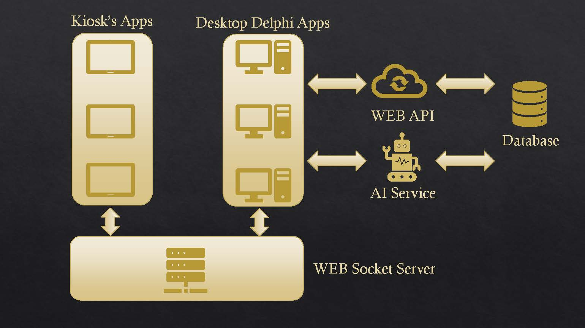

# 🏥 KioskCare – AI & GraphQL Enhanced Hospital Check-In System

**Streamlining Patient Check-In on Touchscreen Kiosks with Real-Time Sync, AI Querying, and GraphQL Precision**

---

## 📋 Project Overview

KioskCare is a modular, real-world healthcare reception system that improves patient check-in efficiency by combining traditional **Delphi-based enterprise software** with **modern web technologies** such as **React**, **WebSockets**, **RESTful APIs**, **GraphQL**, and **AI-powered querying**.

This system allows hospital staff to manage and monitor patient check-ins using kiosks, receive real-time updates, and query patient/appointment data using natural language — all while ensuring accuracy and minimizing manual workload.

---

## 🚀 Live Demo Videos

🎬 **Part 1 – Introduction & Architecture**  
📺 [Watch on YouTube](https://www.youtube.com/watch?v=5SoY0ws3yiM)

🎬 **Part 2 – Live System Demo**  
📺 [Watch on YouTube](https://www.youtube.com/watch?v=k7MZ9b7jL4A)

---

## 📂 Repositories & Source Code

🔹 **Main Desktop App (Delphi)**  
👉 [Reception App (Delphi)](https://github.com/pahangdar/kiosk-care-desktop-delphi/tree/api-integration)

🔹 **WebSocket Server (Node.js)**  
👉 [WebSocket Server (Node.js)](https://github.com/pahangdar/kiosk-care-websocket-server-node.git)

🔹 **Kiosk Client App (React)**  
👉 [Kiosk Verification App (React + WebSocket)](https://github.com/pahangdar/kiosk-care-kiosk-client-react.git)

🔹 **RESTful API (.NET Core)**  
👉 [Backend API (C# + ASP.NET Core)](https://github.com/pahangdar/kiosk-care-api-server-dotnet/tree/postgres)

🔹 **AI Natural Language Service**  
👉 [AI Chat Query Service](https://github.com/pahangdar/kiosk-care-ai-nl2sql-node.git)

🔹 **GraphQL Endpoint (Prototype)**  
👉 [GraphQL Advanced Search Service]()

---

## 📄 Presentations & Diagrams

📊 **PowerPoint Project Introduction**  
🗂 [Download from Google Drive](https://drive.google.com/file/d/1sNzc96rw3XCmD5Zv1FZrzmUiRj9X8WeP/view?usp=drive_link)

📊 **PowerPoint Project Overview & Architecture**  
🗂 [Download from Google Drive](https://drive.google.com/file/d/1b-MHKPuo-7SDaUJXNC2TxnOUFb9qbvgn/view?usp=drive_link)

📊 **PowerPoint Project Workflow**  
🗂 [Download from Google Drive](https://drive.google.com/file/d/1McYCEcU6zqjVJ1lkkWsUOKuDG8tISn63/view?usp=drive_link)

📸 **System Architecture Diagram**  

---

## ⚙️ Technologies Used

- **Delphi 11 (Embarcadero)** – Desktop application & UI
- **React.js** – Kiosk user interface (kiosk mode)
- **Node.js + WebSocket** – Real-time communication server
- **RESTful API** – Backend service for database access
- **PostgreSQL** – Relational database
- **AI/NLP Microservice** – Converts natural language to SQL
- **GraphQL** – For advanced, dynamic data access (prototype)
- **GitHub** – Source control & collaboration

---

## 📌 Key Features

- ✅ Self-service check-in using kiosk tablets
- ✅ Real-time updates via WebSocket
- ✅ Appointment management via REST API
- ✅ AI-powered natural language search in Delphi app
- ✅ Flexible data filtering using GraphQL
- ✅ Clean separation of services and scalable architecture

---

## 🙋 Contact

Feel free to connect with me on [LinkedIn](https://www.linkedin.com/in/pahangdar)  
or send questions via GitHub Issues in any of the linked repositories.

🎬 **My YouTube Channel**  
📺 [Watch on YouTube](https://www.youtube.com/@WhatIveBuiltSaeidsDevPortfolio/playlists)

---

> Created with ❤️ by **Saeid**, Senior Software Developer | Canada  
> Combining legacy systems with modern technology to solve real-world problems.
